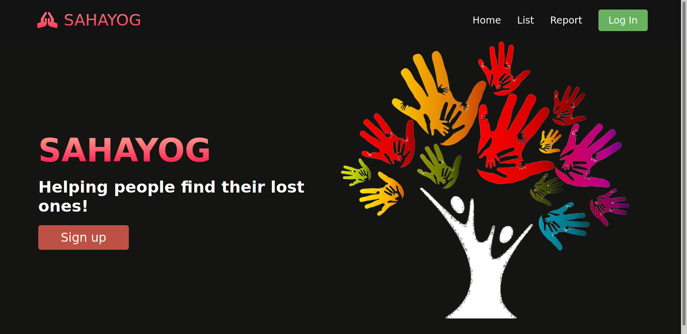
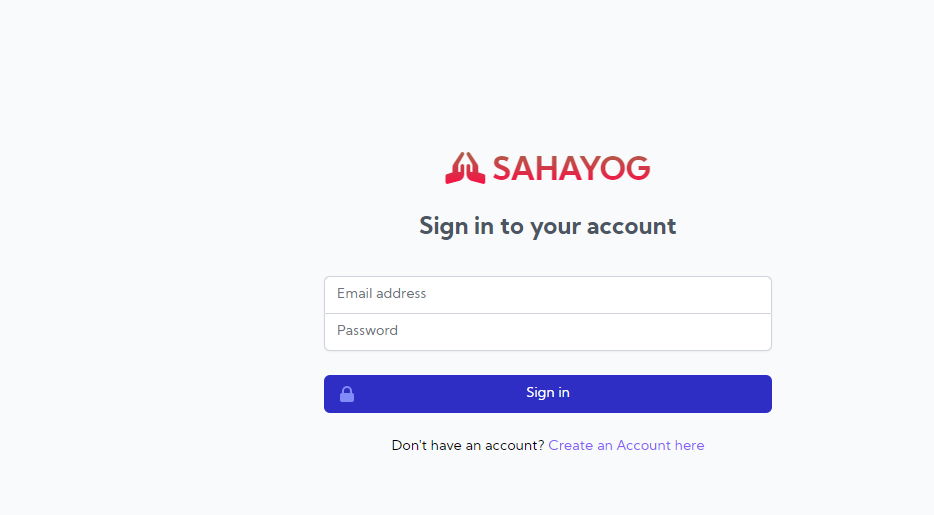
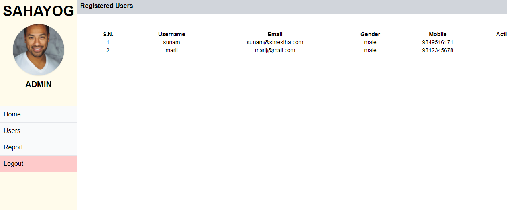
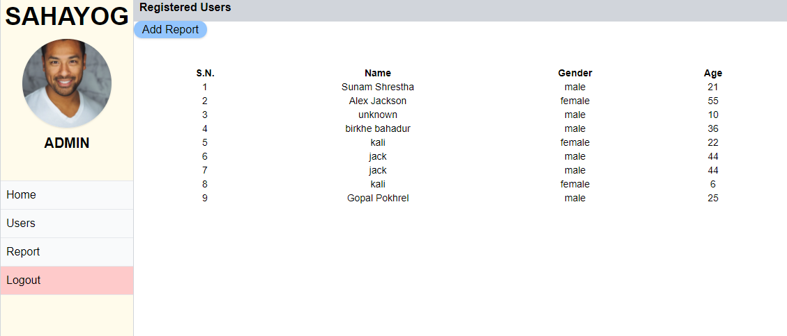

# Sahayog

Helping People Find their lost ones. A public platform to claim finding and lost of missing people.

### Basic overview of project: 

- User registration/login

- Lost one can be reported

- People canfind and view the lost ones from the reported list

- read projectsetup.txt for setup

### What Problem it solves: 

Sahayog is website created using HTML, CSS, JS and PHP where people can post and find about the lost peoples. Since there are large news commming at regular basic of lost people, we try to help all of those people suffering and make it as accessible as possible. First of all , it requires the account for a verification, i.e. asked for some verification documents to authenticate a user, then he/she can login to report for a missing person. Otherwise, posting by any public is not allowed. However any general people can find about the lost people from list sections and can create an account to report as well as post. Details of reported lost persons can be found on details page, which shows all details reported by a verified user.

### How the projects looks: 

### Challenges we ran into: 

We ran into problems while developing at front-end as well as back-end since we are learning.

### Technologies we used: 

       1. HTML     2.CSS    3.JS     4.PHP

### Demo video:

https://www.youtube.com/watch?v=LJoef_9TzP4
